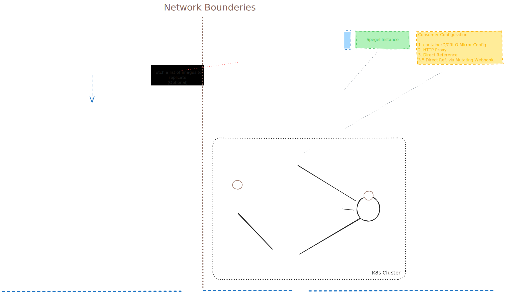

# Harbor Satellite — Brings Container Registries to the Edge

The project aims to decentralize container registries for better accessibility to edge devices.
Satellite registries can be used in stateful or stateless mode with the intention to function as a primary registry for the edge location, or as a fallback option if the central registry is unavailable. Satellite is crucial for operating in areas with limited or no internet, or when you need to distribute images to thousands or edge registries.

## Primary Use Cases

- Overcome connectivity limitations on edge locations.
- Mange distribution of containerized software to edge locations.
- Managing hundreds or thousands of container registries across edge locations.
- Works nicely with Kubernetes, but can also happily run without any container runtime as a bootstrap application.

## Why

Deploying a complete Harbor instance on edge devices in poor/no coverage areas could prove problematic, since :
- Harbor wasn't designed to run on edge devices.(e.g. Multiple processes, no unattended mode)
- Harbor could behave unexpectedly in poor/no connectivity environments.
- Managing hundreds or thousands of container registries is not operationally feasible with Harbor
- Harbor would be too similar to a simple registry mirror

Harbor Satellite aims to be resilient, lightweight and will be able to keep functioning independently of Harbor instances.

##  How it Works

Harbor Satellite synchronizes with the central Harbor registry, when Internet connectivity permits it, allowing it to receive and store images. This will ensure that even in environments with limited or unreliable internet connectivity, containerized applications can still fetch their required images from the local Harbor Satellite.

Harbor Satellite will also include a toolset enabling the monitoring and management of local decentralized registries.

## Typical Use Cases

### Architecture
Harbor Satellite, at its most basic, will run in a single container and will be divided into the following 2 components :

- **Satellite** : Is responsible for moving artifacts from upstream, identifying the source and reading the list of images that needs to be replicated. Satellite also modifies the container runtime configuration, so that the container runtime does not fetch images from remote.
- **OCI Registry** : Is an embedded registry responsible for storing required OCI artifacts locally.
- **Ground Control** : Is a component of Harbor and is responsible for serving a constructed list of images that need to be present on this edge location.

### Replicating From a Remote Registry to the Edge Registry

In this use case, the stateless satellite component will handle pulling images from a remote registry and then pushing them to the local OCI registry. This local registry will then be accessible to other local edge devices, who can pull required images directly from it.

### Replicating From a Remote Registry to an Edge Kubernetes Registry

The stateless satellite component sends pull instructions to Spegel instances running on each Kubernetes node. The node container runtime will then directly pull images from a remote registry to its internal store. Building on Spegel images are now available for other local nodes, removing the need for each of them to individually pull an image from a remote registry.
This use case only works in Kubernetes environments, the major advantage of such a setup compared to use case #1 is that it allows to operate a stateful registry on a stateless cluster.  The only dependency satellite has is on spegel.

### Proxying From a Remote Registry Over to the Edge Registry
The stateless satellite component will be responsible for configuring the local OCI registry running in proxy mode and the configuration of the container runtime. This local registry is handing, image pulls from the remote registry and serving them up for use by local edge devices.  
In a highly dynamic environment where the remote registry operator or edge consumer cannot produce a list of images that need to be present on edge. the Satellite can also act as a remote proxy for edge devices. This ensures the availability of necessary images without the need for a pre-compiled list of images.

## Development
The project is currently in active development. If you are interested in participating or using the product, reach out.

## Community, Discussion, Contribution, and Support
You can reach the Harbor community and developers via the following channels:
- [#harbor-satellite on CNCF Slack ](https://cloud-native.slack.com/archives/C06NE6EJBU1)
